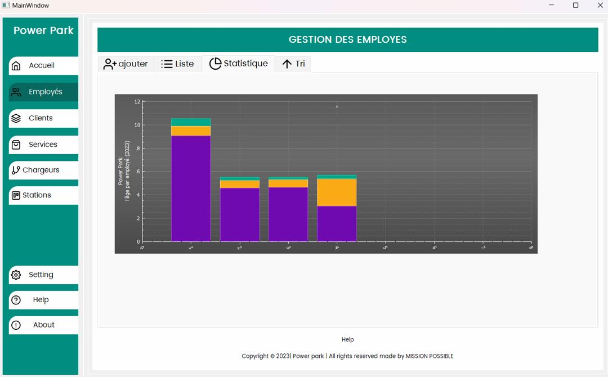

# ⚡ Power Park — Système de Gestion de Station de Recharge Électrique

<p align="center">
  
</p>

> Application desktop développée en **Qt/C++** avec base de données **SQL**, dédiée à la gestion complète d'une infrastructure de recharge pour véhicules électriques.

---

## 📋 Table des matières

- [Aperçu](#aperçu)
- [Fonctionnalités](#fonctionnalités)
- [Stack Technique](#stack-technique)
- [Architecture](#architecture)
- [Prérequis](#prérequis)
- [Installation](#installation)
- [Utilisation](#utilisation)
- [Modules](#modules)
- [Équipe](#équipe)

---

## Aperçu

**Power Park** est une solution de gestion tout-en-un pour les opérateurs de stations de recharge électrique. Elle centralise la gestion des clients, des employés, des chargeurs et des stations, tout en intégrant des technologies avancées comme l'IoT via Arduino, le paiement par carte, les QR codes, la cartographie et les statistiques en temps réel.

---

## ✨ Fonctionnalités

### 👥 Gestion des Employés
- Ajout, modification et suppression des employés
- Visualisation sous forme de liste
- **Statistiques visuelles** : graphiques en barres empilées par tranche d'âge et par rôle
- Tri et filtrage avancés

### 🙋 Gestion des Clients
- Enregistrement et suivi des clients
- Historique des sessions de recharge
- Profils avec informations de contact et de paiement

### ⚡ Gestion des Chargeurs
- Suivi de l'état de chaque chargeur (disponible / en charge / hors service)
- Intégration **IoT via Arduino** pour la supervision en temps réel
- Alertes et notifications en cas de panne

### 🗺️ Gestion des Stations
- Cartographie interactive des stations
- Localisation géographique de chaque borne
- Gestion multi-sites

### 🛠️ Services
- Catalogue des services proposés
- Gestion des tarifs et abonnements
- Suivi des transactions

### 💳 Paiement
- Paiement par carte bancaire intégré
- Génération et scan de **QR codes** pour les sessions de recharge
- Reçus et historique des transactions

### 📊 Statistiques en Temps Réel
- Tableaux de bord dynamiques
- Graphiques interactifs (barres, secteurs, courbes)
- Rapports exportables

---

## 🛠️ Stack Technique

| Composant         | Technologie              |
|-------------------|--------------------------|
| Langage           | C++                      |
| Framework UI      | Qt 5 / Qt 6              |
| Base de données   | SQL (SQLite / PostgreSQL) |
| IoT               | Arduino (Serial/USB)     |
| Paiement          | Intégration API carte    |
| QR Code           | ZXing / QZXing           |
| Cartographie      | Qt Location / Leaflet    |
| Graphiques        | Qt Charts                |
| Plateforme        | Windows / Linux / macOS  |

---

## 🏗️ Architecture

```
PowerPark/
├── src/
│   ├── main.cpp
│   ├── mainwindow/         # Fenêtre principale & navigation
│   ├── employes/           # Module gestion des employés
│   ├── clients/            # Module gestion des clients
│   ├── chargeurs/          # Module chargeurs + IoT Arduino
│   ├── stations/           # Module stations & cartographie
│   ├── services/           # Module services & tarifs
│   ├── paiement/           # Module paiement & QR code
│   └── statistiques/       # Module stats & graphiques
├── database/
│   └── schema.sql          # Schéma de la base de données
├── resources/
│   ├── icons/
│   └── images/
├── arduino/
│   └── charger_monitor.ino # Code Arduino pour IoT
├── PowerPark.pro           # Fichier projet Qt
└── README.md
```

---

## ✅ Prérequis

- **Qt** 5.15+ ou Qt 6.x
- **Qt Creator** (recommandé) ou CMake
- **Compilateur C++17** : GCC, MSVC ou Clang
- **SQLite** (inclus dans Qt) ou **PostgreSQL**
- **Arduino IDE** (pour le module IoT)
- Modules Qt requis : `Qt Widgets`, `Qt SQL`, `Qt Charts`, `Qt Location`, `Qt SerialPort`

---

## 🚀 Installation

### 1. Cloner le dépôt

```bash
git clone https://github.com/MISSION-POSSIBLE/power-park.git
cd power-park
```

### 2. Ouvrir avec Qt Creator

```
Fichier → Ouvrir un projet → sélectionner PowerPark.pro
```

### 3. Configurer la base de données

```bash
# Exécuter le script d'initialisation SQL
sqlite3 powerpark.db < database/schema.sql
```

### 4. Compiler et exécuter

```bash
# En ligne de commande
qmake PowerPark.pro
make
./PowerPark
```

Ou utiliser le bouton **▶ Run** dans Qt Creator.

### 5. (Optionnel) Module Arduino IoT

- Ouvrir `arduino/charger_monitor.ino` dans l'Arduino IDE
- Téléverser sur la carte Arduino
- Configurer le port série dans `Paramètres > Connexion IoT`

---

## 🖥️ Utilisation

Au lancement, l'application affiche le **tableau de bord principal** avec le menu latéral :

| Icône | Module        | Description                                  |
|-------|---------------|----------------------------------------------|
| 🏠    | Accueil       | Vue d'ensemble et KPIs en temps réel         |
| 👤    | Employés      | Gestion du personnel et statistiques RH      |
| 🙋    | Clients       | Base clients et historique                   |
| 🛠️    | Services      | Catalogue des services et tarification       |
| ⚡    | Chargeurs     | Supervision des bornes de recharge           |
| 📍    | Stations      | Carte et gestion des sites                   |
| ⚙️    | Settings      | Configuration générale                       |
| ❓    | Help          | Guide d'utilisation                          |

---

## 📦 Modules Détaillés

### Module Statistiques — Employés
Le graphique en barres empilées (visible dans la capture d'écran) affiche la **distribution d'âge des employés par rôle** pour l'année en cours. Les couleurs représentent différentes catégories (violet = base, orange = intermédiaire, vert = senior).

### Module IoT Arduino
La communication série avec Arduino permet de récupérer l'état électrique des chargeurs (tension, courant, état de charge) et d'afficher des alertes en cas d'anomalie détectée.

### Module QR Code
Chaque session de recharge génère un QR code unique permettant au client de démarrer/arrêter sa charge via l'application mobile ou directement sur la borne.

---

## 👨‍💻 Équipe

Développé avec ❤️ par **MISSION POSSIBLE**

> Copyright © 2023 | Power Park | All rights reserved

---

## 📄 Licence

Ce projet est la propriété de **MISSION POSSIBLE**. Tous droits réservés.

---

<p align="center">
  <strong>Power Park</strong> — Recharger le futur, gérer le présent ⚡
</p>
